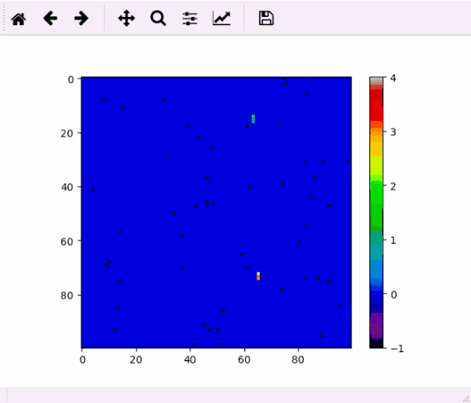

# Tutorial



## Installation

To make your algorithm visable directly on your computer, please install the following pychon packages:
```
numpy
matplotlib
```
All these packages can be installed using pip.

## A Example code
Please put the field.py and your python file in the same directory. And run this code.
```python
import numpy as np
import matplotlib.pyplot as plt
import field.Field as Field

# set canvas refresh rate
refresh_period = 0.01
num_users = 7
field = Field(num_users, 50) # The second argument specifies the food number in the field

def move(num_users):
    return np.random.randint(4, size=(num_users + 1))
    # The function returns (num_users + 1) random numbers, because the field object requires that.

im = None
(field_image, states) = field.go(move(num_users))
print(states, end='')
try:
    im = plt.imshow(field_image.reshape(100, 100), cmap='nipy_spectral')
    plt.pause(refresh_period)
    plt.draw()
except:
    pass
plt.colorbar()

while True:
    move_cmd = move(num_users)
    # move_cmd is a list with (n+1) element, where move_cmd[i] is the i-th user's movement (start from 1).
    (field_image, states) = field.go(move_cmd)
    # you get your field_image which you can plot.
    # you get a states list wherr you can know which user is alive,
    # if states[i-1] == 1, the i-th user is still alive.

    print('\r', end='')
    print(states, end='')

    try:
        im.set_data(field_image.reshape(100, 100))
        plt.pause(refresh_period)
        plt.draw()
    except:
        print()
        break
```

## Code explain

1. place the test file field.py at your working space, and create a new python file main.py

2. import modules at your main.py
```python
import numpy as np
import matplotlib.pyplot as plt
import keyboard
import field.Field as Field
```

3. initialize your field object
```python
# set canvas refresh rate
refresh_period = 0.01
num_users = 7
field = Field(num_users, 50) # The second argument specifies the food number in the field
```

4. define your algorithm function
```python
def move(num_users):
    return np.random.randint(4, size=(num_users + 1))
    # The function returns (num_users + 1) random numbers, because the field object requires that. 
```

5. setup your canvas so that you can see something
```python
im = None
(field_image, states) = field.go(move(num_users))
print(states, end='')
try:
    im = plt.imshow(field_image.reshape(100, 100), cmap='nipy_spectral')
    plt.pause(refresh_period)
    plt.draw()
except:
    pass
plt.colorbar()
```

6. get into a infinite loop where you can start run the field
```python
while True:
    move_cmd = move(num_users)
    # move_cmd is a list with (n+1) element, where move_cmd[i] is the i-th user's movement (start from 1).
    (field_image, states) = field.go(move_cmd)
    # you get your field_image which you can plot.
    # you get a states list wherr you can know which user is alive,
    # if states[i-1] == 1, the i-th user is still alive.
```

7. in the while loop, print all users' states and show your map
```python
    print('\r', end='')
    print(states, end='')

    try:
        im.set_data(field_image.reshape(100, 100))
        plt.pause(refresh_period)
        plt.draw()
    except:
        print()
        break
```

# Detail description of Field Object

## Initialize the Field object 

You can initialize the Field object with the number of user provided. You can also change the map size. (suppose there are n users)

## run Field.go() method to start the simulation every time step

1. input arguments (```move```)
    
- a list of numbers (0,1,2,3) indicates the user action (coresponding to Up,Right,Down,Left). Please add a dummy number at the front of the list, whose length should be (n+1). Then the number of ```move[i]``` indicates the ```i```-th user's action

2. return values

- ```field_image``` (the 0-th element): is the np array which has size that you specified, or 100 * 100 by default. Since the image is a numpy array, each pixel with value ```2*i``` is the i-th user's head, and ```2*i-1``` is the i-th user's body.

- ```states``` (the 1-th element): is a list of 0 or 1, which indicates dead or alive of each user. the first user's state is in ```states[0]```